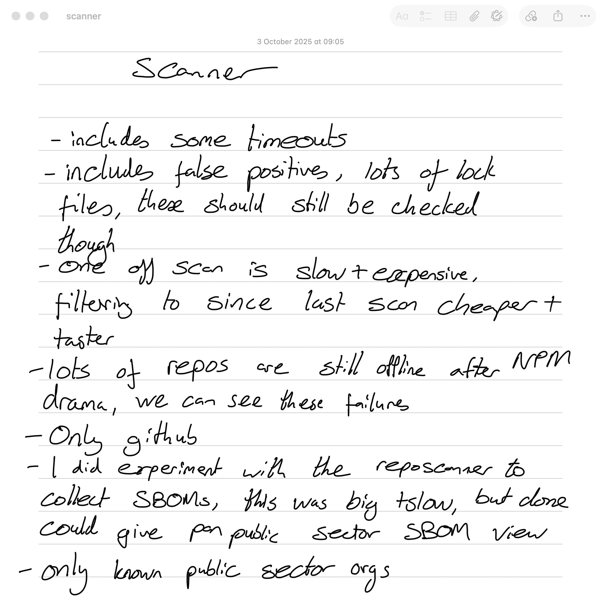
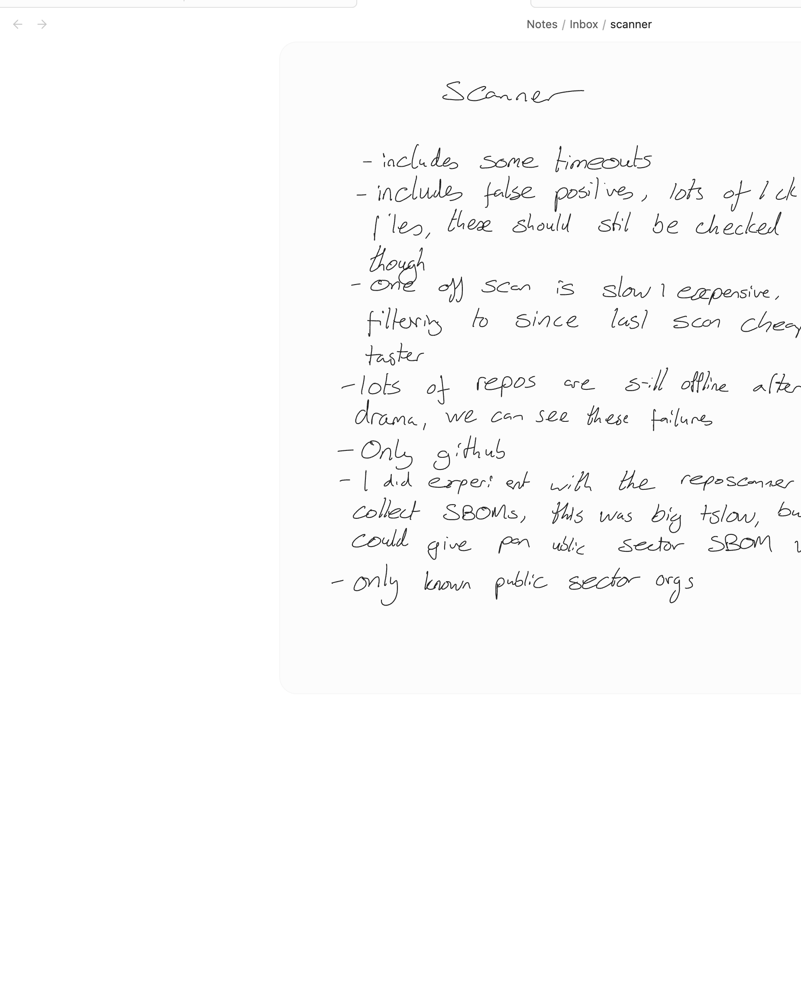
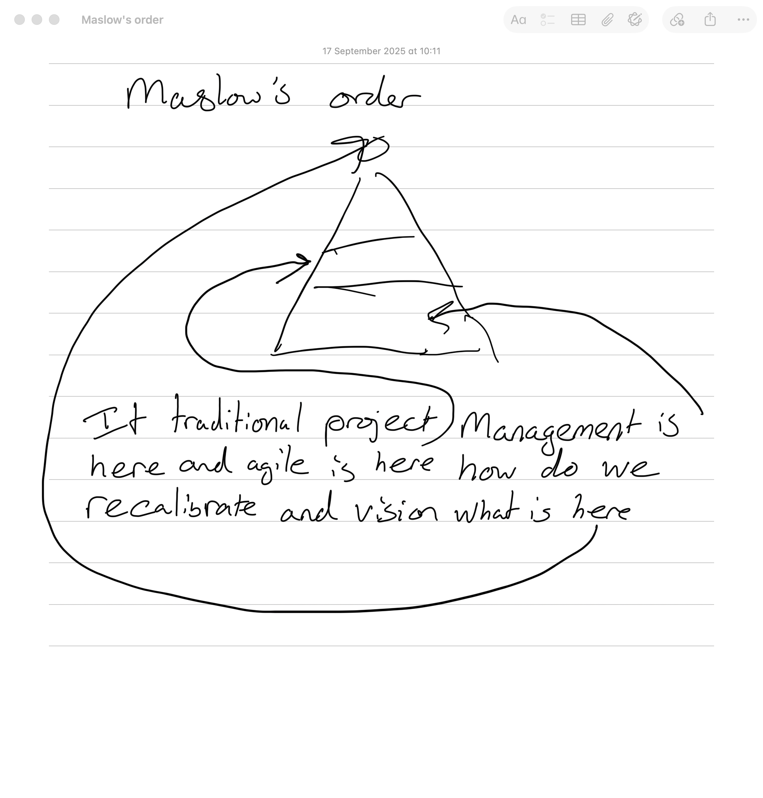
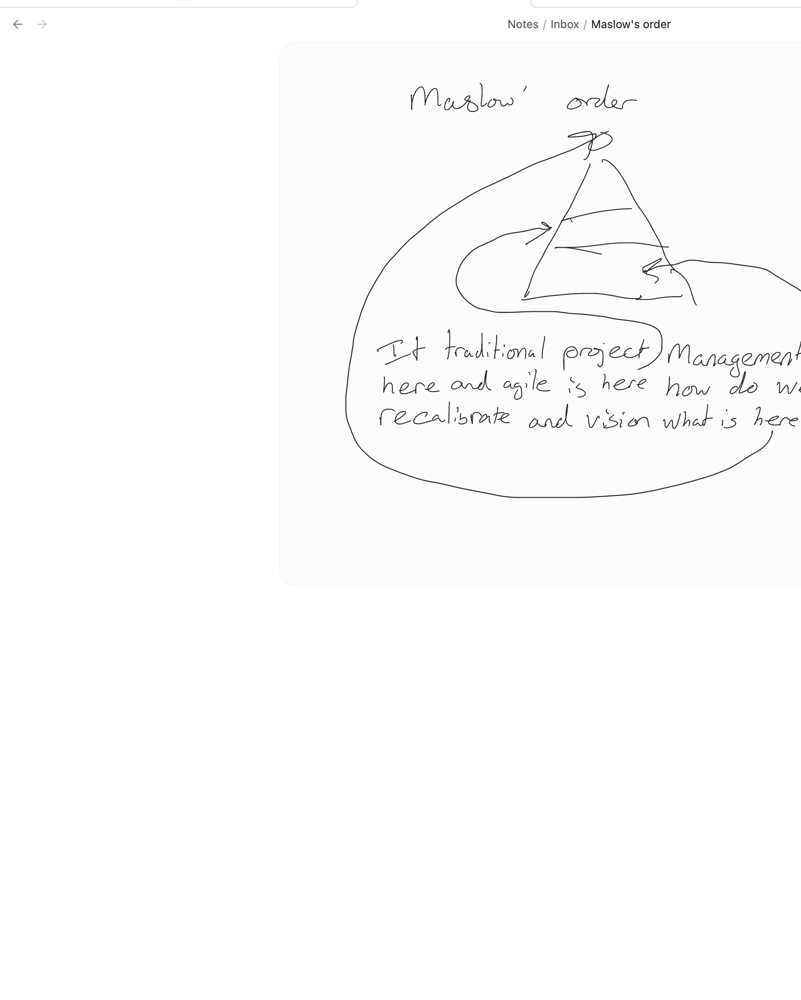

# apple-notes-to-obsidian

A high-fidelity migrator from **Apple Notes** to **Obsidian**, with the part nobody else gets right: **handwritten drawings come across as live, editable vector strokes inside Obsidian's [Ink plugin](https://github.com/daledesilva/obsidian_ink)**, not as flat PNG screenshots.

If you've been on Apple Notes for years and the only reason you've never moved is that your handwritten pages would either get rasterised or thrown away, this is the unlock.

---

## Run it

```bash
git clone https://github.com/chrisns/apple-notes-to-obsidian.git
cd apple-notes-to-obsidian
./install.sh ~/Documents/MyVault
python3 migrate.py --sync ~/Documents/MyVault/Notes/Inbox
```

That's it. `install.sh` checks dependencies, builds the Swift decoders, drops the CSS fix into your vault, and registers the datetime properties. Then `migrate.py --sync` pulls every note across.

You'll need three one-time things on your machine before the first run:

1. **Full Xcode** installed (not just CommandLineTools) and selected: `sudo xcode-select -s /Applications/Xcode.app`. We link against private frameworks shipped only in the full SDK.
2. **Pandoc**: `brew install pandoc`.
3. **Full Disk Access** for your terminal: System Settings → Privacy & Security → Full Disk Access → add Terminal/iTerm. Apple Notes' SQLite is sandboxed; without this the first SQL read fails with "operation not permitted."

And two clicks inside Obsidian after `install.sh`:

1. Settings → Community plugins → browse → install **"Ink"** (daledesilva/obsidian_ink) and enable it.
2. Settings → Appearance → CSS snippets → toggle **"ink-stroke-fill"** on.

That's the full setup. Re-run `migrate.py --sync` any time to pick up new edits — it's idempotent and frontmatter-anchored, so you can move and rename migrated notes around the vault and sync still finds them.

> **Tip:** start with `--limit 10` on a scratch vault to feel out the output before committing to the full migration.

```bash
python3 migrate.py --sync ~/Documents/MyVault/Notes/Inbox --limit 10
python3 migrate.py --sync ~/Documents/MyVault/Notes/Inbox          # full
python3 migrate.py --sync ~/Documents/MyVault/Notes/Inbox --force  # rebuild all
```

---

## Why I built this

I have been on Notes.app for ages. Long enough that the iPad Apple Pencil pages, the corner-of-meeting scribbles, the back-of-envelope diagrams, the pre-talk braindumps, the 3am ideas — they have all stacked up in there. **Hundreds of handwritten pages I love and can't search.** Trapped, because Apple Notes' "scribble" format is not anything you can usefully export. Print to PDF rasterises it. Copy-paste rasterises it. The real strokes — the PencilKit data, the Paper bundles — are locked in a private CRDT format that Apple has never opened up.

For a long time the answer was "stay on Apple Notes." It was the least-bad option.

The Obsidian **[Ink plugin](https://github.com/daledesilva/obsidian_ink)** changes the calculus. It is _just about good enough_ now. It gives you:

- a real tldraw canvas embedded inline in your markdown
- ruled-paper styling and a proper writing-pen tool
- vector strokes that survive zoom, theme switching, and re-export
- the file format is JSON, so it diffs and syncs

Not perfect — the rendering quirks deserve their own paragraph, see [§ Render gotchas](#render-gotchas) — but for the first time, an Obsidian-native handwriting story exists that is good enough to actually use.

So the question becomes: **can we get the existing handwritten content out of Apple Notes and into the Ink plugin's `.writing` files, without losing fidelity?**

This repo is the answer. **Yes.** Vector strokes round-trip. Handwriting is searchable (Apple's own OCR is pulled out of SQLite and dropped into the markdown frontmatter). Checklists arrive as actual GFM checkboxes. Filesystem dates match the source. Everything else (pasted images, photos, PDFs) comes through too.

For me this was the great unlock. For years I've quietly worried that committing to a non-Apple notes tool meant orphaning the handwriting. It doesn't, any more. This script is what got me confident enough to migrate ~1000 notes in one go.

If that's where you are, read on.

---

## What it looks like

Two real notes from my own vault, before and after. Left: Apple Notes. Right: the same note after migration, rendered by the Ink plugin in Obsidian.

### "Scanner"

| Apple Notes | Obsidian (Ink plugin) |
| --- | --- |
|  |  |

### "Maslow's order"

| Apple Notes | Obsidian (Ink plugin) |
| --- | --- |
|  |  |

The strokes on the right are real vector strokes — selectable, editable, ink-on-top works, dark-mode flips them automatically.

---

## What it actually migrates

| Apple Notes content | Result in Obsidian |
| --- | --- |
| **Plain text** | Markdown (GFM via Pandoc) |
| **Checklists** | `- [ ]` and `- [x]` with checked state preserved |
| **Headings, bold, italic, links, code** | Preserved through the HTML→MD pipeline |
| **Native PencilKit drawings** (`com.apple.drawing.2`) | Vector tldraw `draw` shapes inside an Ink `.writing` file. Every stroke kept, with per-point pressure / azimuth / altitude. |
| **"Paper" handwriting bundles** (`com.apple.paper`) | Same. Decoded via a hand-rolled `PaperKit` + `Coherence` Swift shim — the only public-API path I know of for Paper bundles. |
| **Pasted images / photos / scans** | Extracted to `_attachments/<note-slug>/` and embedded as standard markdown ``. |
| **Auto-OCR'd handwriting text** | Aggregated from all attachment rows into a `handwriting-ocr` frontmatter field. **Drawings become full-text searchable.** |
| **Auto-OCR'd image text** | Same idea, in `image-ocr`. |
| **Created / modified dates** | Both as ISO datetimes in frontmatter **and** stamped onto the macOS filesystem (birthtime + mtime). Obsidian's File Explorer, Dataview, etc. see the original dates. |
| **Original folder name** | Preserved in `original-folder` frontmatter. |
| **Apple Notes' Core Data id** | Preserved in `source-id` frontmatter so the migrator is round-trippable and idempotent. |

What it doesn't migrate (yet):

- Locked / password-protected notes.
- iCloud-shared notes' collaborator state.
- Inline tables. Pandoc handles them but not always cleanly; YMMV.
- A small number of older Paper bundles whose format isn't supported by the Coherence shim — they crash the Swift decoder cleanly and the script falls back to image-embed for that note.

---

## What `install.sh` does, and the manual equivalent

If you'd rather drive the install yourself:

```bash
./build.sh                                                # builds decode_pkdrawing + decode_paper
pip install fractional-indexing                           # tldraw shape-index format
cp obsidian/snippets/ink-stroke-fill.css <vault>/.obsidian/snippets/
# add {"types": {"created":"datetime","modified":"datetime"}} to <vault>/.obsidian/types.json
```

Why each piece:

- **`./build.sh`** compiles two Swift CLIs: `decode_pkdrawing` (handles the older `com.apple.drawing.2` PencilKit blobs) and `decode_paper` (handles modern Paper bundles via the Coherence + PaperKit shims in `shims/`). Needs full Xcode for the private-framework `.tbd` stubs.
- **`fractional-indexing`** generates tldraw-compatible shape index keys (`a0`, `a1`, `aV`, …). Naive `a0001`-style padding fails tldraw's validator.
- **The CSS snippet** works around an Ink-plugin bug where every stroke `<path>` is force-filled, turning thin lines into filled blobs. The snippet reasserts `fill: none` on stroked paths. One line of CSS, night-and-day rendering difference.
- **`types.json`** entries make Obsidian's Properties panel render the dates with calendar widgets and sort correctly in the file explorer.

### Single-note runs

```bash
python3 migrate.py "x-coredata://<store-uuid>/ICNote/p<pk>" /path/to/vault/Notes/Inbox
```

Useful for debugging a specific note. You won't usually need this; `--sync` is what you want day to day.

---

## Frontmatter reference

Each migrated note ends up with frontmatter like this:

```yaml
---
source: apple-notes
source-id: "x-coredata://<store-uuid>/ICNote/p3936"
original-folder: "Meeting notes"
created: 2024-10-29T21:53:08
modified: 2026-04-22T17:56:27
handwriting-ocr: |
  Control plane
  Review AI training
  Sandbox - probe
  Add models + harnesses
image-ocr: |
  Quarterly report — page 3
  ...
---
```

Concrete things this enables in Obsidian:

- **Search across handwritten content.** Apple's PencilKit OCR is decent. Now it's in your vault.
- **Sort by real dates.** `file.cday` / `file.mday` in Dataview, plus the visible "modified" column in File Explorer, both reflect the original Apple Notes timestamps.
- **Round-trip safety.** `source-id` makes the migrator idempotent. You can move, rename, organise — sync still finds the right file.
- **Provenance.** Every note carries `source: apple-notes` so you can `WHERE source = "apple-notes"` and never confuse migrated content with native Obsidian notes.

---

## Sync semantics

Sync is **one-way Notes → Obsidian**. The Apple Notes app remains the source of truth; this script never writes to it. (Apple Notes changes you make on the iPhone or iPad still flow into Notes.app; sync picks them up next run.)

Behaviours:

- **Frontmatter-anchored.** The index of "what's already migrated" walks the *entire vault* (not just the inbox) looking for any markdown file with `source: apple-notes` in its frontmatter. The `source-id` is the join key.
- **Skip when up-to-date.** If a note's `modified` in Apple Notes ≤ the `modified` recorded in the existing markdown's frontmatter, the body is left alone. Filesystem dates are still re-stamped (cheap, idempotent — fixes drift from manual edits or older migrations).
- **Update in place.** If you've moved a migrated note from `Notes/Inbox/Foo.md` to `Notes/Projects/Foo.md`, sync will keep updating it at `Notes/Projects/`. Net-new notes default to the inbox.
- **Renames in place.** If you change a note's title in Apple Notes, sync renames the markdown file in its current folder (not back to the inbox).
- **Idempotent end-to-end.** Re-running with no source changes is a no-op apart from the date-stamp pass. Re-running with `--force` rebuilds every body.
- **Move-friendly.** You can re-organise the vault after migration however you like — folder structure, bulk rename, dragging into nested folders — and sync stays correct.

What it doesn't do:

- Detect deletions. If you delete a note in Apple Notes, the markdown stays in your vault. (Tombstone-tracking would need a richer state file; not in scope today.)
- Push your edits back to Apple Notes. Don't rely on Obsidian-side changes surviving the next sync if the same note is re-edited in Notes.app — Apple's `modified` will be newer and the body will be overwritten.

---

## Render gotchas

The Ink plugin is great for the price (free) but a few things are worth knowing before you lean on it:

1. **Force-fill CSS bug.** Already mentioned: install the bundled CSS snippet or every stroke renders as a blob.
2. **Snapshot schema is v1.** The plugin's "create new handwriting" command emits a tldraw v1 schema. If you write a v2 snapshot you can build, but you have to match what the plugin expects. This repo emits v1. If a future plugin update bumps the schema and you stop seeing your strokes, that'll be why.
3. **Hardcoded page id.** The plugin recognises a doc as a "writing canvas" iff the page record has id `page:3qj9EtNgqSCW_6knX2K9_`. Don't ask. The shim emits exactly that id; if you regenerate via tldraw and end up with a random id, the embed loses its writing-canvas affordances (no toolbar, click does nothing).
4. **Fractional indices.** Tldraw validates shape `index` keys against the [`fractional-indexing`](https://github.com/rocicorp/fractional-indexing) format. Naive zero-padded `a0001` fails validation. We use the reference Python implementation to generate them.
5. **Variable-width strokes.** PencilKit captures real per-point pressure. Tldraw's `draw` shape uses these via the `z` field on each point, but the plugin auto-overrides `isPen` based on whether the first two points' `z` is exactly 0 or 0.5. If you want clean lines (rather than perfect-freehand variable-width outlines), set `z: 0.5` so the auto-detection picks the simpler renderer. This repo does that.

If you find anything else surprising, please open an issue.

---

## How it actually works

Top-down for the curious. Skip if you just want to use the thing.

### The text path

1. AppleScript dumps the note's `body` (HTML), `name`, `creation date`, `modification date`, and `container of` (folder), NUL-delimited so we can parse safely even though HTML can contain anything.
2. SQLite (`~/Library/Group Containers/group.com.apple.notes/NoteStore.sqlite`) is read in read-only mode for the things AppleScript silently drops:
   - the list of attachments on the note (drawings + papers + photos)
   - the auto-OCR'd `ZHANDWRITINGSUMMARY` and `ZOCRSUMMARY` text on each attachment row, aggregated up to the note
   - the gzipped `ZICNOTEDATA.ZDATA` protobuf which carries paragraph-level checklist state (the AppleScript HTML body strips checklists down to bullets, losing the checked/unchecked flag)
3. HTML → markdown via Pandoc, with a small post-processing layer that:
   - strips Apple's repeated title (the body always starts with the title as a divider)
   - collapses Pandoc's `<br>` → `\` line-break tokens
   - converts bullets into GFM task-list items (`- [ ]`/`- [x]`) wherever the protobuf says the paragraph was a checklist
4. Frontmatter is built from the AppleScript dates and the SQLite OCR, and prepended.
5. The file is written, then `os.utime` + `SetFile -d` set the FS dates to match the source.

### The drawing path

When the body has an inline `` *and* the SQL says the note has a drawing/paper attachment in the same position, we take the binary path:

- **`com.apple.drawing.2`** (the older format): `ZMERGEABLEDATA1` is a serialised `PKDrawing`. We pipe it through `decode_pkdrawing.swift`, which is a 5-line `PKDrawing(data:)` call that gives us the strokes back as Swift objects, dumped as JSON.

- **`com.apple.paper`** (the format Apple's Notes apps actually use today): the bundle on disk is a CRDT working state managed by the private `Coherence` framework. `PaperMarkup(dataRepresentation:)` only accepts the *serialised snapshot*, not the bundle. There's no public API path between the two.

  This is where the work was. The bridge:

  1. `Coherence.framework` is a private framework with no `.swiftinterface` shipped. We hand-craft a minimal `Coherence.swiftmodule` declaring only the types we need (`CRContext`, `Capsule<A>`, `CRDataStoreBundle<A>`, `CRDT`, the relevant enums) — `shims/CoherenceShim/`.
  2. `PaperKit.framework` exposes `PaperMarkup` publicly but not `Paper` (the `CRDT`-conforming type that `Capsule` actually wraps). We extend the public PaperKit swiftinterface with a hand-crafted addition that declares `PaperKit.Paper` and its `Coherence.CRDT` conformance — `shims/PaperKitShim/`.
  3. `decode_paper.swift` then does:
     ```swift
     let ctx = CRContext.newTransientContext(uniqueAssetManager: false, encryptionDelegate: nil)
     let capsule: Capsule<Paper> = try CRDataStoreBundle<Paper>.read(
       ctx, url: bundleURL,
       fileVersionPolicy: .all,
       allowedEncodings: [.version1, .version2, .version3, .version4],
       allowedAppFormats: [0, 1, 2, 3, 4, 5]
     )
     ```
     and walks the capsule via `Mirror` to find every `PKStrokeStruct`, resolve its `_inherited` (ink + transform) and `_properties.path` (a real `PencilKit.PKStrokePath`), and dump the strokes as JSON.

  This works because the private-framework binaries are loaded into memory automatically when the public PaperKit is linked, and because `Coherence` is exposed via a `.tbd` text-based dylib stub in the SDK. The shims describe the types so the Swift compiler accepts them; the runtime resolves the actual symbols against the real frameworks.

- The JSON shape is the same in both cases. `ink_writer.py` builds a tldraw v1 snapshot from it: writing-container + writing-lines + one `draw` shape per stroke, all wrapped in the `.writing` JSON envelope the Ink plugin expects.

If you want to read the code, the order is roughly: `migrate.py` (orchestration) → `dump_note.applescript` (body fetch) → `decode_pkdrawing.swift` / `decode_paper.swift` (binary parsing) → `ink_writer.py` (tldraw doc construction).

### Why the Coherence approach beats the alternatives

I tried a few things before landing here:

- **Render to PDF and parse paths.** PaperKit has `PaperMarkup.draw(in: CGContext)`. Render to a `CGPDFContext`, parse the resulting PDF with PyMuPDF. *Tried it.* PencilKit pen strokes render as filled outline polygons, not stroked paths, so "stroke recovery" becomes "polygon-to-centerline reconstruction." The geometry gets mushy, pressure data is gone, and the JSON is huge.
- **Trace the FallbackImage PNG with potrace.** Quick. Lossy on stroke pressure. Vector but not the right vector — the strokes lose their hand-drawn-ness and look generated.
- **Reverse-engineer the CRDT protobuf from scratch.** The Paper bundle's `data.sqlite3` stores PKInk-shaped protobuf inside a Coherence envelope. Inside is exactly what we want. *But* faithfully decoding it would be days of work and would break on the next macOS update.

The Coherence shim is the cleanest of these. Apple's own framework decodes its own format; we just describe the API so the compiler links it. The shim is ~80 lines of swiftinterface across the two modules.

---

## Repo layout

```
.
├── install.sh                  One-shot installer (deps + build + vault setup)
├── build.sh                    Compile the two Swift decoders
├── migrate.py                  Main orchestrator + CLI (sync, single-note)
├── ink_writer.py               Build .writing JSON files from stroke data
├── dump_note.applescript       Fetch body/dates/folder for one note
├── list_notes.applescript      (helper, not used by sync mode)
├── decode_pkdrawing.swift      PKDrawing → strokes JSON
├── decode_paper.swift          Paper bundle → strokes JSON (uses shims/)
├── shims/
│   ├── CoherenceShim/          Hand-crafted Coherence.swiftmodule
│   └── PaperKitShim/           Hand-crafted PaperKit.swiftmodule (extends Apple's)
└── obsidian/
    └── snippets/
        └── ink-stroke-fill.css CSS fix for the Ink plugin's force-fill bug
```

---

## Limitations & caveats

- **macOS-only.** Apple Notes data is on a Mac. There's no path on Linux or Windows.
- **Private frameworks.** Coherence is private. The shim works against the macOS 26 Tahoe ABI; if Apple bumps the framework's Swift mangling, the shim will need re-syncing.
- **Older Paper bundle versions** sometimes crash the Swift decoder (`SIGTRAP`). Out of ~200 paper bundles I tested against, ~5% failed. The script logs them and moves on; the rest of the note still migrates. Open an issue with a (sanitised) example bundle if you want to help debug.
- **Inline tables** in Apple Notes survive but Pandoc can be lossy on complex ones.
- **Locked notes** (password-protected) are skipped.
- **Search-index quality** depends on Apple having OCR'd the note at all. New / never-opened notes haven't been processed yet — re-run migration after Apple's background indexer has caught up.

---

## Acknowledgements

- The Obsidian **[Ink plugin](https://github.com/daledesilva/obsidian_ink)** does the rendering. It is what made any of this worth doing.
- **[apple_cloud_notes_parser](https://github.com/threeplanetssoftware/apple_cloud_notes_parser)** (Ruby) is the canonical reference for the Apple Notes SQLite schema. I didn't use the code directly but the documentation of the protobuf layout was invaluable.
- **tldraw** for the canvas format the Ink plugin builds on.
- **PencilKit** team at Apple, even if they made Paper bundles harder than they needed to be.

---

## Licence

MIT. See [LICENSE](./LICENSE).
